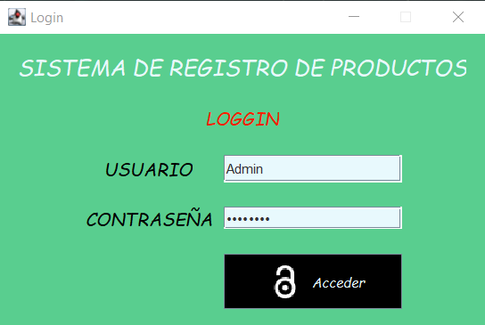

# CRUD SYSTEM PRODUCTS ⭐📝
### Members: **Edison Rivera** - **Estela Chipantasi**

# **User Guide** 📑

1. **You have to log in** to go to the main window. 🔐
   
 

2. Next, the main window will be displayed where **you must choose a section to work with, otherwise the buttons will remain locked.**

Examples:

3. Now you can **CREATE, UPDATE, SEARCH/READ OR DELETE** the data of each of the sections.

## CREATE
* The window will be displayed where you can add the requested information depending on the section you have chosen. 
  

## UPDATE

* When you need to update some data, you need to enter the primary key according to the section to update. 
Key for the section:

**Products = Product code**

**Providers = Providers RUC**

**Categories = Categories code**

After pressing the consult button, all the data will be shown and you will be able to update the field you want.

## SEARCH/READ

* If you want to search for any product, category or supplier. First select the corresponding section and then choose the way to search, it can be by name or code.
  
**For section Providers the code = RUC**

## DELETE

* In the case of delete. First you must select the section where you want to delete the information, then search for the section key:
  
**Products = Product Code**

**Suppliers = RUC Suppliers**

**Categories = Category Code**

And from there delete.

## **TYPE OF ERRORS 💀:**

   
**[-] A record with the same PK already exists.** 🔑
   

**[-] There is no record to reference (FK)** 🗝
   

**[-] The field exceeds the limit.**
